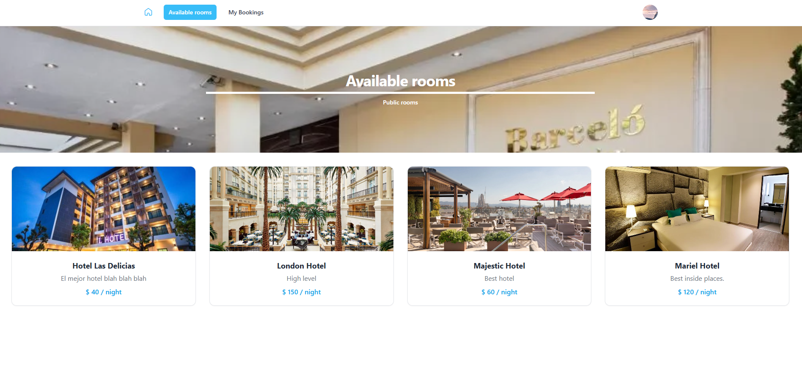

## Booking CRUD - PHP


Tarea asignada de Kodigo Academy.

### Descripción

Este proyecto es una aplicación web que permite a los usuarios crear, leer, actualizar y eliminar datos de un CRUD (Crear, Leer, Actualizar y Eliminar) en una base de datos MySQL.

---

Es un proyecto simple de CRUD de práctica por lo que se podrían implementar más funcionalidades de seguridad y funcionalidades de acorde a un proyecto completo de reservación de alojamientos.

Indicaciones asignadas: notes.txt

---

### Servicios utilizados para el despliegue de la aplicación

- Railway (Build de Docker)
- Clever Cloud (Base de datos, también se puede utiliza railway)

---

### Requisitos de tarea

- Landing Page de Alojamientos
- Crear una Cuenta e Iniciar Sesión
- Vista de Cuenta de Usuario
- Función de Eliminar Alojamientos
- Usuario Administrador

## Instalación

1. Clonar el repositorio

```
git clone https://github.com/1frencho/basic-booking-mvc-php-crud
```

2. Mover la carpeta del proyecto a la raíz de la carpeta con la sub carpeta booking-crud-php ya que el htaccess está configurada para seguir esa ruta.

- Si utilizas otra sub carpeta, modificar la variable de entorno BASE_PATH

```
C:/laragon/www/booking-crud-php
```

- Si utilizas Xampp, la carpeta debería ser:

```
C:/xampp/htdocs/booking-crud-php
```

3. Instalar dependencias y paquetes

```
composer install
```

```
npm install
```

- Renombrar el archivo .env.example a .env y asignar las credenciales propias de la base de datos.

4. Importar la base de datos usando el archivo:

```
booking-crud.sql
```

5. Ejecutar el servidor web y dirigirse a:

```
http://localhost/booking-crud-php/public/
```

6. Habilitar Tailwind CSS para que observe los cambios

```
npm run tailwind

```

## Build de la aplicación

Requisitos:

- Docker Desktop
- Docker Compose

1. Construir el contenedor de Docker, la configuración ya está publicada.

```
docker-compose build
```

2. Iniciar el contenedor de Docker y desenlazar la terminal.

```
docker-compose up -d
```

3. Abrir la aplicación en el navegador.

```
http://localhost:8080
```

4. Al subir la aplicación a un hosting el proveedor de servicios debería de exponer las variables de entorno para ser usadas con $\_ENV.

- Solamente en entorno local se aplica en el inicio de la aplicación para cargar las variables de entorno. "./public/index.php"

```
$dotenv = Dotenv::createImmutable(__DIR__ . '/..');
$dotenv->load();

```
